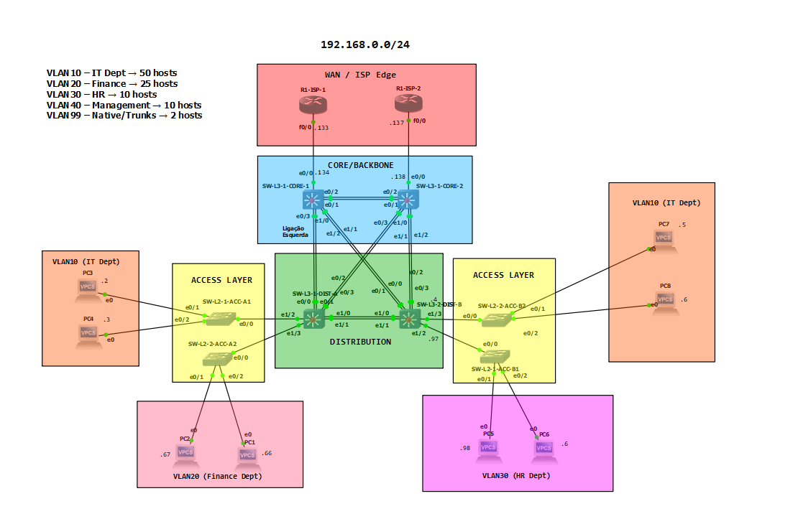
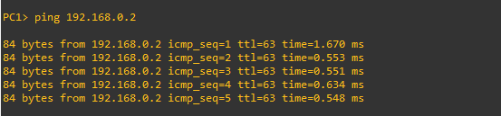
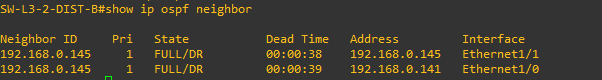
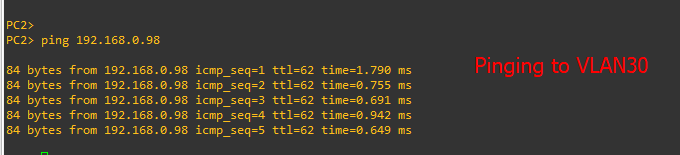
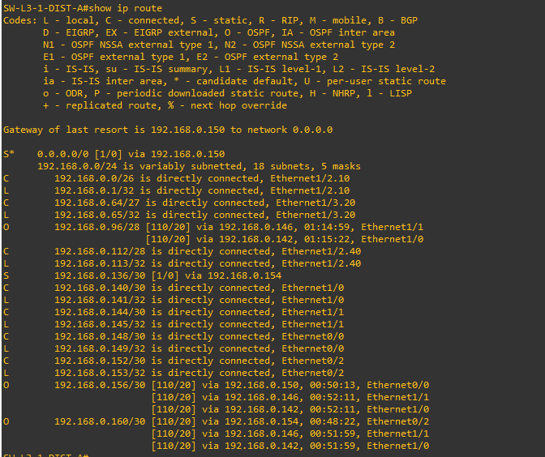
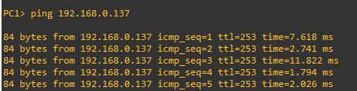

# CCNA Lab

### 🔹 Introduction

This project demonstrates the design and implementation of an **enterprise multi-layer hierarchical network** in GNS3, following Cisco’s **three-tier model** (Access, Distribution, Core).\
The lab integrates multiple CCNA topics including VLANs, Inter-VLAN routing, OSPF, WAN integration, redundancy, and VLSM addressing.

The following diagram represents the logical topology of the enterprise network:



***

### 🔹 Basic Device Configuration (Initial Setup)

This section covers the **initial baseline configuration** applied to all devices (routers and switches).\
The goal is to ensure every device has a unique hostname, secure access (console, vty, and enable passwords), and a consistent structure before applying advanced features.

#### Hostname Convention

* **WAN / ISP Routers**: `R1-ISP-1`, `R1-ISP-2`
* **Core Switches (L3)**: `SW-L3-CORE-1`, `SW-L3-CORE-2`
* **Distribution Switches (L3)**: `SW-L3-DIST-A`, `SW-L3-DIST-B`
* **Access Switches (L2)**: `SW-L2-1-ACC-A1`, `SW-L2-2-ACC-A2`, `SW-L2-1-ACC-B1`, `SW-L2-2-ACC-B2` \` Password and Access Configuration

```bash
! Set hostname
hostname <DEVICE_NAME>

! Enable secret password
enable secret cisco123

! Encrypt all passwords
service password-encryption

! Console access
line console 0
 password cisco
 login
 logging synchronous

! VTY access (Telnet/SSH)
line vty 0 4
 password cisco
 login
 transport input ssh telnet

```

SSH Preparation (for remote access)

```bash
! Set domain name
ip domain-name lab.local

! Generate RSA keys
crypto key generate rsa modulus 1024

! Local user for SSH login
username admin secret admin123

! Configure VTY lines for local login
line vty 0 4
 login local
 transport input ssh
```

✅ With this baseline:

* Devices are uniquely identified.
* Access is secured with encrypted passwords.
* SSH provides secure remote management.

***

### 🔹 VLSM Addressing Plan

The entire topology was addressed using the private block **192.168.0.0/24**, which was subnetted with **Variable Length Subnet Masking (VLSM)** to efficiently allocate IP space across VLANs and WAN links.

The design principle followed was:

* Start allocating from the **largest subnet requirement** (VLAN10 – IT).
* Continue sequentially with smaller VLANs.
* Reserve /30 networks for WAN point-to-point links.

| VLAN/Link         | Network Address  | Subnet Mask     | Broadcast Address | Usable Range                  | Purpose            |
| ----------------- | ---------------- | --------------- | ----------------- | ----------------------------- | ------------------ |
| VLAN10 – IT       | 192.168.0.0/26   | 255.255.255.192 | 192.168.0.63      | 192.168.0.1 – 192.168.0.62    | IT Department PCs  |
| VLAN20 – Finance  | 192.168.0.64/27  | 255.255.255.224 | 192.168.0.95      | 192.168.0.65 – 192.168.0.94   | Finance Department |
| VLAN30 – HR       | 192.168.0.96/28  | 255.255.255.240 | 192.168.0.111     | 192.168.0.97 – 192.168.0.110  | HR Department PCs  |
| VLAN40 – Mgmt     | 192.168.0.112/28 | 255.255.255.240 | 192.168.0.127     | 192.168.0.113 – 192.168.0.126 | Device Management  |
| VLAN99 – Native   | 192.168.0.128/30 | 255.255.255.252 | 192.168.0.131     | 192.168.0.129 – 192.168.0.130 | Native VLAN/Trunks |
| WAN1 (ISP1–CORE1) | 192.168.0.132/30 | 255.255.255.252 | 192.168.0.135     | 192.168.0.133 – 192.168.0.134 | ISP1 link          |
| WAN2 (ISP2–CORE2) | 192.168.0.136/30 | 255.255.255.252 | 192.168.0.139     | 192.168.0.137 – 192.168.0.138 | ISP2 link          |

✅ With this addressing plan:

* Each VLAN has just enough IP addresses for its expected hosts.
* WAN links are efficiently allocated with /30 subnets.
* The entire design fits inside the original **192.168.0.0/24** block without waste.

***

### 🔹 VLAN and Inter-VLAN Configuration

* VLANs were defined at the Access layer.
* Distribution switches provided **Inter-VLAN Routing** via subinterfaces.

Example (SW-L3-DIST-A):

```bash
interface e1/2.10
 encapsulation dot1Q 10
 ip address 192.168.0.1 255.255.255.192

interface e1/2.20
 encapsulation dot1Q 20
 ip address 192.168.0.65 255.255.255.224

interface e1/2.40
 encapsulation dot1Q 40
 ip address 192.168.0.113 255.255.255.240

```

`ip routing` was enabled to allow communication across VLANs.

***

### 🔹 Distribution Redundancy (DIST-A ↔ DIST-B)

Two /30 point-to-point links ensured redundancy between Distribution switches.\
OSPF propagated VLAN routes across both blocks.

Example (DIST-A):

```bash
interface e1/0
 ip address 192.168.0.141 255.255.255.252
interface e1/1
 ip address 192.168.0.145 255.255.255.252

router ospf 1
 network 192.168.0.0 0.0.0.63 area 0
 network 192.168.0.64 0.0.0.31 area 0
 network 192.168.0.112 0.0.0.15 area 0
 network 192.168.0.140 0.0.0.3 area 0
 network 192.168.0.144 0.0.0.3 area 0
```

✅ Result: VLANs from both sides are reachable with redundant paths.

***

### 🔹 Core–ISP Integration (WAN)

Each Core switch connects to a dedicated ISP router using /30 links.

* Static default routes were configured on Cores.
* ISPs used static return routes.
* OSPF redistributed the default route enterprise-wide.

✅ Internal hosts gained Internet reachability via both ISPs.

***

### 🔹 Core Interconnect (CORE1 ↔ CORE2)

A /30 link was configured directly between the two Core switches.\
This provides:

* Extra OSPF adjacency.
* Redundant paths across the backbone.
* Load balancing (ECMP).

***

### 🔹 Validation

* **Ping tests**: VLAN gateways, inter-VLAN routing, WAN connectivity.
* **OSPF neighbors**: Verified on Distribution and Core.
* **End-to-End reachability**: PCs could reach ISP routers.

Screenshots included in the report confirm functionality.

***

#### 🔹 Validation – VLAN & Inter-VLAN Routing

To validate the VLAN setup and routing, representative hosts were configured with IP addresses from their subnets.

**Test 1 – VLAN10 Host to Gateway**


**Test 2 – VLAN20 Host to Gateway**


**Test 3 – Inter-VLAN Communication (VLAN10 ↔ VLAN20)**



***

#### 🔹 Validation – OSPF & Inter-Distribution Links

**Test 4 – OSPF Neighbors**

DIST-A


DIST-B



**Test 6 – End-to-End Connectivity (VLAN20 ↔ VLAN30)**



***

### 🔹 Core–ISP Integration (WAN)

To provide external connectivity, each Core switch was connected to a dedicated ISP router using /30 subnets.\
The Core switches were configured with static default routes pointing to their respective ISP next-hop, and the ISPs were configured with static return routes back to the enterprise LAN.\
To distribute the default route dynamically across the enterprise, OSPF was used with the `default-information originate` command.

SW-L3-CORE-1 (connected to ISP1)

```bash
interface e0/0
 description Link to ISP1
 ip address 192.168.0.134 255.255.255.252
 no shutdown

ip route 0.0.0.0 0.0.0.0 192.168.0.133

router ospf 1
 passive-interface default
 no passive-interface e0/3     ! link to DIST-A
 no passive-interface e1/1     ! link to DIST-B
 network 192.168.0.150 0.0.0.3 area 0
 network 192.168.0.158 0.0.0.3 area 0
 default-information originate
```

SW-L3-CORE-2 (connected to ISP2)

```bash
interface e0/0
 description Link to ISP2
 ip address 192.168.0.138 255.255.255.252
 no shutdown

ip route 0.0.0.0 0.0.0.0 192.168.0.137

router ospf 1
 passive-interface default
 no passive-interface e0/3     ! link to DIST-A
 no passive-interface e1/1     ! link to DIST-B
 network 192.168.0.154 0.0.0.3 area 0
 network 192.168.0.162 0.0.0.3 area 0
 default-information originate
```

ISP-1 Router

```bash
interface e0/0
 ip address 192.168.0.133 255.255.255.252
 no shutdown

ip route 192.168.0.0 255.255.255.0 192.168.0.134
```

ISP-2 Router

```bash
interface e0/0
 ip address 192.168.0.137 255.255.255.252
 no shutdown

ip route 192.168.0.0 255.255.255.0 192.168.0.138
```

***

🔹 Validation – WAN Connectivity

Test 7 – Default Route Learned via OSPF (DIST-A)



Test 8 – PC to ISP1


Test 9 – PC to ISP2



***

✅ With this configuration, all internal VLANs have external connectivity through both Core routers. Each ISP has a static return path, and default routes are dynamically injected into the enterprise OSPF domain.

***

### 🔹 Core Interconnect (CORE1 ↔ CORE2)

To ensure full redundancy and equal-cost multipath routing, a dedicated point-to-point /30 network was configured between the two Core switches. This provides an additional OSPF adjacency and allows traffic to traverse the opposite core in case of a link or ISP failure.

SW-L3-CORE-1

```bash
interface e0/2
 description Link to CORE2
 ip address 192.168.0.149 255.255.255.252
 no shutdown

router ospf 1
 no passive-interface e0/2
 network 192.168.0.148 0.0.0.3 area 0
```

SW-L3-CORE-2

```bash
interface e0/2
 description Link to CORE1
 ip address 192.168.0.150 255.255.255.252
 no shutdown

router ospf 1
 no passive-interface e0/2
 network 192.168.0.148 0.0.0.3 area 0
```

***

#### 🔹 Validation – Core Adjacency

**Test 10 – OSPF Neighbor (CORE1 ↔ CORE2)**

On CORE1:


On CORE2:


***

✅ With this configuration, the two Core switches maintain a direct OSPF adjacency.\
The enterprise routing domain now supports **redundant paths** and **load balancing** across both Cores, improving resiliency and stability.

***

### 🔹 Conclusion

This lab successfully demonstrates the design and implementation of a multi-layer hierarchical enterprise network using GNS3.\
Key objectives were achieved as follows:

* **Baseline configuration** was applied to all devices, including hostname conventions, secure passwords, and SSH access.
* **VLSM subnetting** ensured efficient use of the 192.168.0.0/24 block, with dedicated ranges for user VLANs, management, and WAN point-to-point links.
* **VLAN segmentation** was deployed at the Access layer, with Inter-VLAN routing provided by the Distribution switches.
* **Dynamic routing with OSPF** was configured between Distribution and Core layers, ensuring full reachability and redundancy.
* **Core–Core interconnect** allowed equal-cost multipath routing and resiliency.
* **WAN integration with ISPs** provided external connectivity, with static default routes injected into the OSPF domain for distribution across the enterprise.

✅ With this design, the network supports:

* Segmentation of departments through VLANs.
* Redundant paths and high availability across the Distribution and Core layers.
* External connectivity via dual ISPs.
* A scalable and modular topology, aligned with Cisco’s three-tier hierarchical design principles (Access, Distribution, Core).

This project consolidates key CCNA topics including VLANs, trunking, Inter-VLAN routing, OSPF, IP addressing with VLSM, and WAN integration, and serves as a strong portfolio piece for enterprise network design.
