# Project: Live Honeypot Deployment & Threat Analysis

* **Author:** Pedro Antunes
* **Date:** July 2025

### 1. Project Objectives
The primary goal of this project was to gain pratical, hands-on experience in defensive security and threat intelligence by:
* Deploying a multi-service honeypot (T-Pot) in a live cloud environment.
* Capturing and analyzing real-world, unsolicited attack traffic from the internet.
* Understanding common attacker Tactics, Techniques, and Procedures (TTPs).
* Learning about system monitoring, log analysis, and data visualization with tools like the ELK stack.

### 2. Architecture & Setup

The honeypot was deployed on a cloud virtual machine to ensure complete isolation from my personal network and to attract organic internet traffic.

* **Cloud Provider:** DigitalOcean
* **Virtual Machine Specs:**
    * 8 GB RAM 
    * 4 vCPUs
    * 160 GB Disk Storage
* **Operating System:** Ubuntu 22.04 (LTS)
* **Honeypot Software:** T-Pot Standard Edition (which includes multiple honeypots like Cowrie, Dionaea, Honeytrap, etc.).

**Network Configuration:**
All common service ports were exposed to maximize the attack surface. Administrative SSH access was moved to a non-standard high port (64295), and the web management UI runs on port 64297. Both are protected via firewall rules allowing only trusted IPs.

## 3. Data & Findings

After just over 24 hours of operation, the honeypot registered over **35,000 attack events**, showcasing the sheer volume of opportunistic scans and attacks present on the open internet.

### 3.1 Honeypot Sensor Distribution

The following graph shows the number of events captured by each honeypot sensor running on T-Pot:

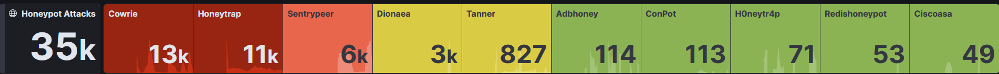

**Breakdown of attack events by honeypot sensor:**

| Sensor           | Description             | Events   |
|------------------|--------------------------|----------|
| **Cowrie**       | SSH brute-force attacks  | 13,000   |
| **Honeytrap**    | General network scans    | 11,000   |
| **Sentrypeer**   | IP reputation analysis   | 6,000    |
| **Dionaea**      | Malware capture          | 3,000    |
| **Tanner**       | SMB/RDP honeypot         | 827      |
| **Adbhoney**     | Android Debug Bridge     | 114      |
| **ConPot**       | Industrial systems (ICS) | 113      |
| **H0neytr4p**     | Unknown services trap   | 71       |
| **Redishoneypot**| Redis honeypot           | 53       |
| **Ciscoasa**     | Cisco ASA emulation      | 49       |

> 🧠 **Insight:** Over 68% of all events were directed at SSH and general network scan traps. This highlights attackers' focus on brute-forcing credentials and discovering exposed services.

---

### 3.2 Attack Type Overview

This bar chart provides a visual breakdown of the honeypot sensors most targeted by attackers:

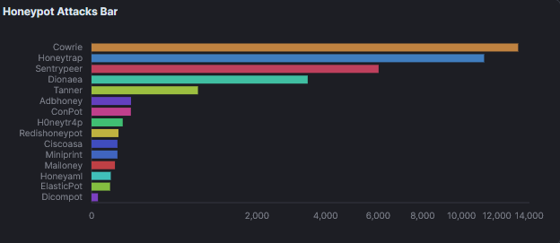

> 🔍 **Insight:**  
> The dominance of **Cowrie**, **Honeytrap**, and **Sentrypeer** suggests attackers are primarily focused on:
> - Brute-forcing SSH login credentials.
> - Scanning for open ports and services.
> - Being identified in known-malicious IP lists.

---

### 3.3 Attack Timeline & Source IPs

The histogram below illustrates the number of attack events over time and the number of unique source IPs involved:

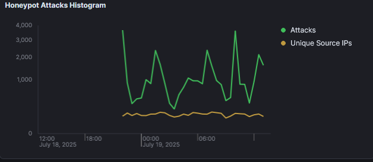

> ⏱️ **Observation:**  
> - Attack traffic fluctuates heavily, with periodic spikes reaching up to **3,000+ attacks/hour**.  
> - The number of unique IP addresses remains relatively constant, indicating repeated automated probing from specific sources (likely botnets).

---

### 3.4 Targeted Ports Over Time

The following chart displays the volume of attacks over time, segmented by **destination port**. This allows us to identify which services attackers are attempting to exploit.

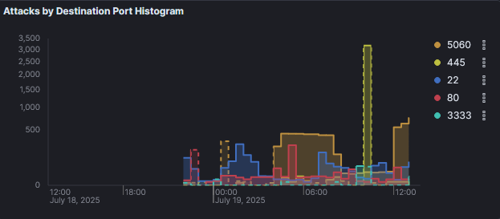

| Port   | Service                   |
|------  |---------------------------|
| `5060` | SIP (VoIP)              |
| `445`  | SMB (Windows File Share)|
| `22`   | SSH                     |
| `80`   | HTTP (Web)              |
| `3333` | Common custom/backdoor  |

> 🚨 **Notable Observations:**
> - A **massive spike on port 445** (SMB) likely indicates mass scanning for **EternalBlue-type vulnerabilities** or Windows file share exploits.
> - Port **5060 (SIP)** and **22 (SSH)** also saw sustained interest, reflecting common attack vectors for VoIP abuse and brute-force login attempts.
> - Even obscure ports like `3333` were regularly hit, suggesting **wide-range port scanning**.

### 3.5 Geographic Attack Distribution

#### Attacks by Country (Histogram)

This chart shows the attack volume over time segmented by **source country**, based on IP geolocation:

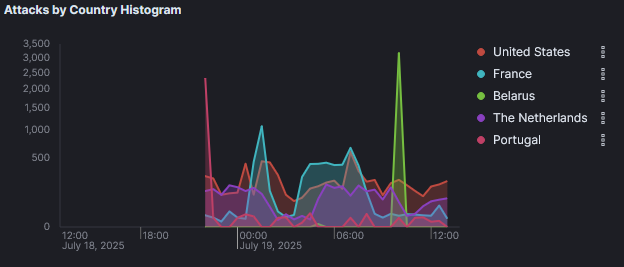

> 🌍 **Insight:**  
> The **United States**, **France**, and **Belarus** were the most frequent sources of attacks. Some spikes — especially from Belarus — reached over 3,000 attacks/hour, likely indicating coordinated automated scans.

#### Attacks by Country (Pie Chart)

This pie chart summarizes the total percentage of attacks by country:

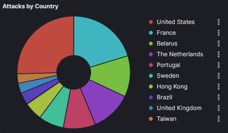

> 🧭 **Top Origin Countries:**  
> - United States  
> - France  
> - The Netherlands  
> - Belarus  
> - Portugal  
> These trends reflect common regions used for botnet infrastructure or poorly managed servers.

---

### 3.6 Attacker Reputation

The chart below visualizes the reputation categories of source IP addresses involved in the attacks:

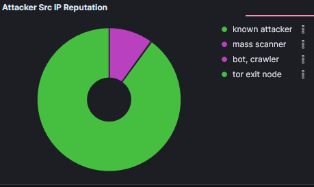

> 🛑 **Observation:**  
> - The vast majority of attacking IPs were flagged as **known attackers**.
> - A smaller portion was categorized as **mass scanners** or **bots/crawlers**.
> - No traffic was detected from **Tor exit nodes**, which is somewhat unexpected.

---

### 3.7 OS Fingerprinting (P0f Analysis)

P0f fingerprinting attempts to identify the **operating systems** of the attacking clients:

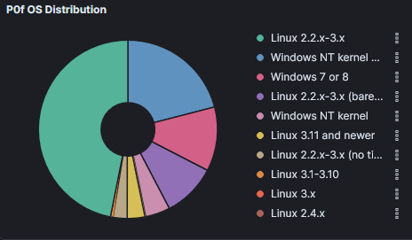

> 💻 **Detected OS Types:**
> - Many attackers were using **older Linux kernels** (2.2.x–3.x), which may point to outdated bots or infected IoT devices.
> - Some originated from **Windows NT/7** systems.
> - The diversity suggests a mix of **botnets**, **custom scripts**, and **compromised legacy machines**.

---

### 3.8 Honeypot Attack Summary (Pie Chart)

This final visualization summarizes the distribution of attacks per honeypot service:

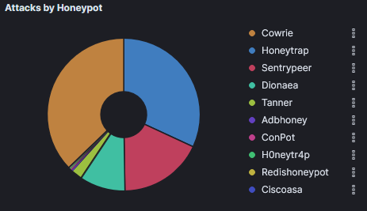

> 🧩 **Insight:**  
> Cowrie, Honeytrap, and Sentrypeer again dominate, as seen earlier. This pie chart reinforces the idea that attackers focus on SSH and general port scans above all else.

### 3.9 Intrusion Detection Alerts (Suricata)

Suricata is a Network Intrusion Detection System (NIDS) included in T-Pot. The chart below shows the volume and category of alerts triggered over time:

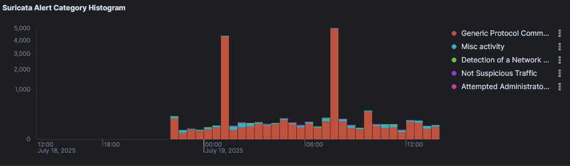

> 🚨 **Top Alert Categories Detected:**
> - **Generic Protocol Command Decode**  
> - **Detection of a Network Scan**  
> - **Misc Activity**  
> - **Attempted Administrator Privilege Gain**

These alerts help identify common exploitation attempts or suspicious payloads, often invisible at a firewall level.

---

### 3.10 SSH Brute Force Attempts (Credentials)

Cowrie recorded thousands of login attempts with a wide variety of usernames and passwords. Below are the most common:

#### Most Used Usernames

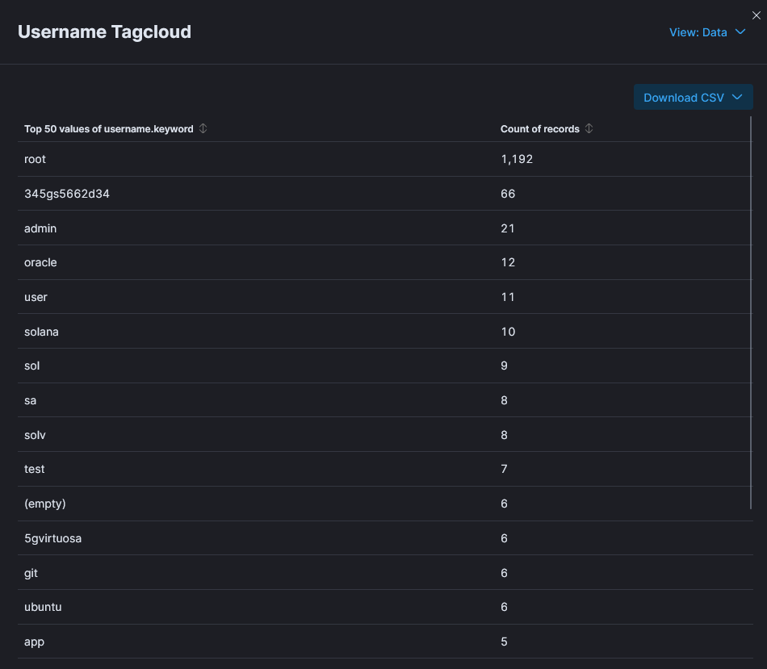

> 👤 **Top usernames attempted:**
> - `root` (1192 attempts)
> - `admin`, `oracle`, `user`, `ubuntu`, `test`
> - Some usernames suggest **automated targeting** of specific software or environments (`solana`, `git`, `sa`)

#### Most Used Passwords

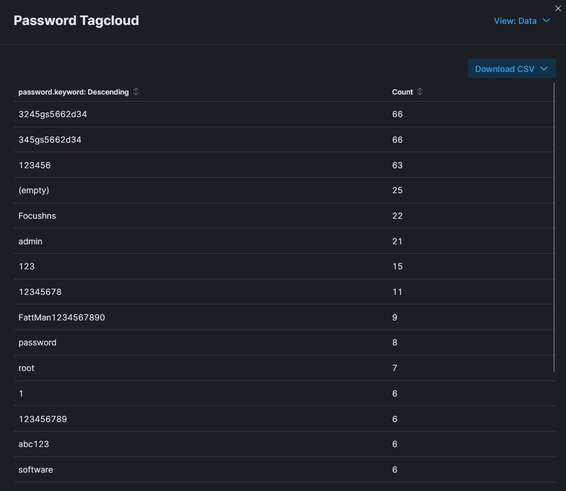

> 🔑 **Top passwords attempted:**
> - Obvious weak passwords: `123456`, `admin`, `123`, `password`
> - User-specific guesses: `3245gs5662d34`, `Focushns`, `FattMan1234567890`
> - Blank or empty passwords were also frequently tried

> 🧠 **Conclusion:** These credentials clearly indicate the use of brute force automation tools that test common and weak combinations. Using strong, unique credentials and key-based authentication is essential.

### 3.11 Top ASNs and Source IPs

This table provides insight into the **most active Autonomous Systems (ASNs)** and **top source IP addresses** involved in attacks:

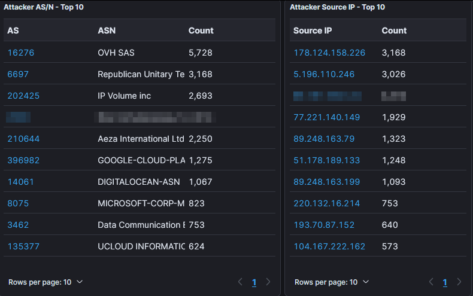

> 🌐 **Top ASNs by Attack Volume:**
> - **OVH SAS** – 5,728 events  
> - **Republican Unitary Telecomm.** – 3,168 events  
> - **IP Volume Inc.** – 2,693 events  
> - **Google Cloud** and **DigitalOcean** also appear, indicating use of public cloud infrastructure for scanning or attacks  
> - Some AS names are intentionally obfuscated (possibly privacy-protected or malicious actors using hidden ASN registration)

> 📊 **Top Attacking IPs:**
> - IPs like `178.124.158.226` and `5.196.110.246` were involved in **3,000+ attacks each**
> - This shows that **a few IPs are responsible for high-volume, automated activity**
> - These could be scanning bots or compromised machines used in distributed attacks

> ⚠️ **Note:** It's important to remember that these IPs may not represent the original attacker — they could belong to compromised hosts or VPN exits.

### 3.12 Suricata Alert Signatures (Top 10)

In addition to the alert categories, Suricata also logs specific **signatures** triggered by suspicious or malformed traffic. The table below shows the most frequently triggered signatures:

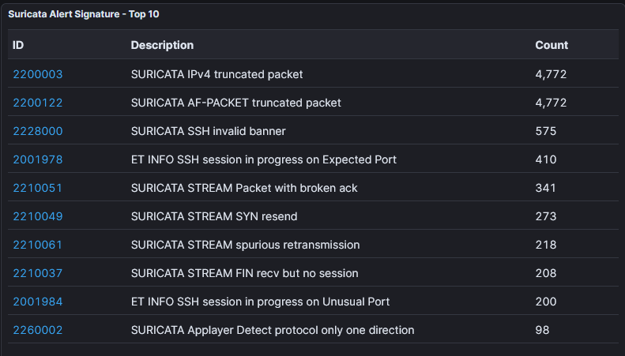

> 🧪 **Top Alert Signatures:**
> - `SURICATA IPv4 truncated packet` and `AF-PACKET truncated packet` — may indicate malformed or fuzzed packets used in evasion attempts.
> - `SSH invalid banner` and `SSH session in progress on unusual port` — often signal automated SSH scanners or misconfigured clients.
> - Several `SURICATA STREAM` events point to **TCP irregularities**, such as retransmissions, missing sessions, or protocol misuse.

> 🔍 **Takeaway:**  
> These alerts provide low-level visibility into the **technical fingerprint** of attackers — not just the services they target, but **how they behave at the packet level**.

## 4. Lessons Learned

This project provided real-world exposure to the scale and tactics of opportunistic attacks targeting exposed systems on the public internet. Key takeaways include:

- ⚠️ The internet is **constantly scanned** — even fresh, unadvertised IPs receive thousands of attacks within minutes.
- 🔐 **SSH brute-force** and **service discovery scans** are the most common tactics observed.
- 🧠 Attackers rely heavily on **weak/default credentials**, making hardening and monitoring essential.
- 🔎 **Suricata IDS** added another layer of visibility by capturing low-level traffic anomalies.
- 📊 Data visualization via the **ELK stack** enabled clear insight into attacker behavior patterns.

The experience also helped reinforce important defensive skills:

- Deploying and isolating cloud infrastructure for security testing.
- Parsing and analyzing real-time log data.
- Interpreting raw indicators (IP reputation, ports, ASNs, protocols) and transforming them into actionable intelligence.

---

## 5. Future Work

To expand on this project and continue learning, here are some planned next steps:

- 📆 **Extend the deployment** window to capture more meaningful trends over time.
- 🌐 Automate **threat enrichment** (GeoIP, ASN, Shodan lookups) for attacker IPs.
- 📡 Compare T-Pot with other honeypot solutions (e.g., [OpenCanary](https://github.com/thinkst/opencanary)).
- 📈 Build a live dashboard with **Grafana** or integrate with SIEM tools like **Wazuh** or **TheHive**.
- 🔔 Configure **alerting mechanisms** to get notified on high-risk behavior in real time.
- 🧪 Test custom fake services to observe targeted exploit attempts more precisely.

---

## 6. Appendix

### 📂 Project Tools & Stack

| Component | Purpose |
|----------|---------|
| **T-Pot** | Multi-honeypot framework |
| **Cowrie, Dionaea, Honeytrap** | Emulated services (SSH, SMB, scan traps) |
| **ELK Stack** | Log aggregation, search, and visualization |
| **Suricata** | Intrusion detection system |
| **DigitalOcean** | Cloud hosting provider |

### 📚 References

- [T-Pot GitHub](https://github.com/telekom-security/tpotce)
- [Suricata Rules](https://docs.suricata.io/)
- [MITRE ATT&CK Framework](https://attack.mitre.org/)
- [Elastic Stack Documentation](https://www.elastic.co/guide/index.html)

