- **Author:** Pedro Daniel Gonçalves Antunes
- **Date:** August 2025
- **Target:** `10.10.252.54`

___
## **1. Introduction**

This report documents the compromise of a vulnerable CTF machine simulating a recruitment website running on Apache/Ubuntu. The compromise was achieved by chaining multiple weaknesses:

- Poorly implemented file upload filter allowing arbitrary PHP code execution.
- Insufficient hardening of cron jobs, where PATH hijacking was possible due to inclusion of a user-owned directory.
- Misconfigurations allowing persistence and privilege escalation to root.

The report highlights each stage of the attack lifecycle: reconnaissance, gaining foothold, privilege escalation, and post-exploitation. Recommendations for mitigation are also provided.

___
## **2. Initial Enumeration**

### 2.1 Nmap Service Scan

The first step was reconnaissance to identify exposed services and versions. A service and version detection scan was executed with the following command:

```bash
nmap -sC -sV -A 10.10.252.54
```
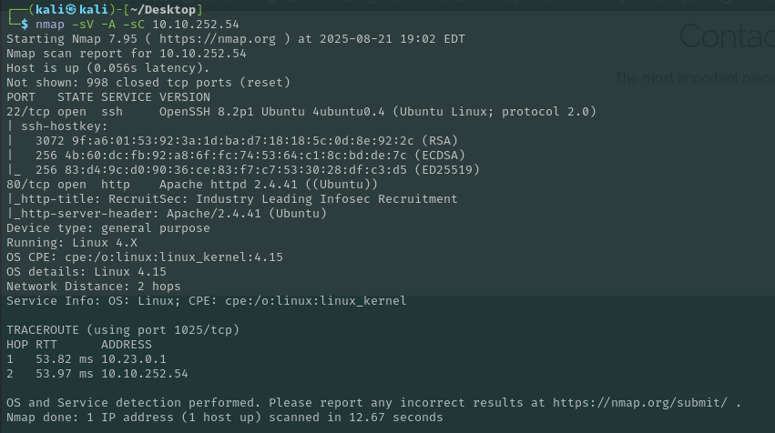

**Results:**

- **22/tcp – OpenSSH 8.2p1 (Ubuntu 20.04)**
- **80/tcp – Apache 2.4.41 (Ubuntu)**
- No additional high-value services exposed.
The host runs a typical Apache/PHP stack on Ubuntu 20.04, indicating that web exploitation is the likely entry point.

### 2.2 Web Application Review

Navigating to port 80 revealed a recruitment-themed website. On the main page, a **CV upload form** was identified.


This suggested potential file upload vulnerabilities that could lead to remote code execution.

___

## **3. Gaining an Initial Foothold**

### 3.1 Initial Upload Attempt

When attempting to upload a simple PHP file through the browser, the application responded with a warning message:

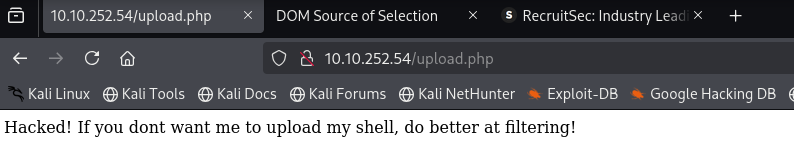

Inspecting the source code of `upload.php` revealed the following logic:

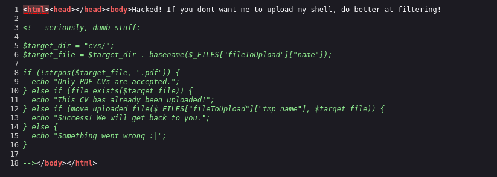


```php
if (!strpos($target_file, ".pdf")) {
echo "Only PDF CVs are accepted.";
}
```

The code only checked whether the string `.pdf` appeared in the filename, without validating the actual file extension or MIME type. This meant that any file containing `.pdf` in its name (e.g., `shell.pdf.php`) would pass the filter and be accepted.

### 3.2 Exploiting with cURL

Using the browser upload form always redirected back to the same error page and did not allow the exploit to succeed. To bypass this, a manual HTTP POST request was made using `cURL`:

```bash
curl -i -X POST \

-F 'fileToUpload=@shell.pdf.php;type=application/pdf' \

http://10.10.252.54/upload.php
```

This successfully uploaded the malicious PHP file to the `/cvs/` directory, bypassing the weak filter.

### 3.3 Webshell Confirmation

Once the payload was uploaded, the webshell was tested by executing system commands directly through the browser. For example:


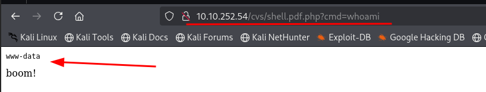

```url
http://10.10.252.54/cvs/shell.pdf.php?cmd=whoami
```

The output confirmed that code execution was successful and commands were being executed under the `www-data` user.

___
### 3.4 Reverse Shell Setup

To obtain a more interactive session, a reverse shell was prepared. A PHP reverse shell one-liner was identified from a penetration testing cheatsheet (https://pentestmonkey.net/cheat-sheet/shells/reverse-shell-cheat-sheet) and executed through the webshell. Meanwhile, on the attacker machine, a Netcat listener was started:

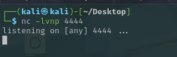

This listener waited for incoming connections from the target system.

### 3.5 Reverse Shell Connection

The reverse shell connected successfully back to the Netcat listener, granting command execution directly on the victim system:

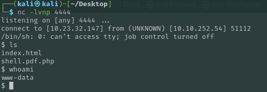

From here, basic commands confirmed the session was running as the `www-data` user.

### 3.6 User Flag Retrieval

Further exploration of the system revealed a user directory `/home/lachlan` containing the first flag:

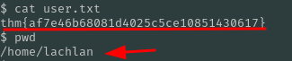

**User Flag:** `thm{af7e46b68081d4025c5ce10851430617}`

____
# 4. Privilege Escalation

### 4.1 Cron Job Enumeration

With an initial foothold established, the next objective was privilege escalation. System enumeration revealed interesting files in the `/etc/cron.d` directory:

```bash
ls -la /etc/cron.d
```

Among them, a file named **persistence** stood out as potentially exploitable. This indicated that a scheduled task running as root could be leveraged for privilege escalation.

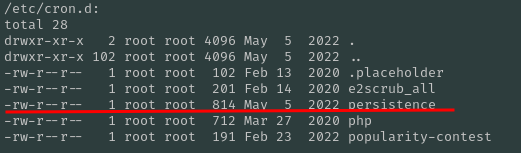

### 4.2 Cron Persistence Analysis

Reviewing the contents of the `persistence` cron job revealed multiple entries that executed every minute:

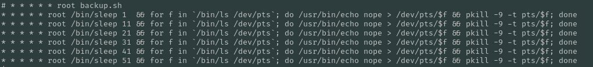

Key issues observed:

- The commands invoked `ls` and `pkill` without absolute paths.
- The PATH variable in the cron file included `/home/lachlan/bin` before system directories.

This meant any malicious binary named `ls` or `pkill` placed in `/home/lachlan/bin` would be executed with root privileges.

### 4.3 Writable Directory Confirmation

To confirm exploitability, permissions for the directory were checked:

```bash
ls -ld /home/lachlan/bin
```
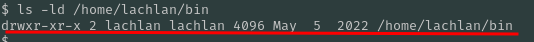

As shown above, the directory was writable by the `lachlan` user, confirming it could be abused for PATH hijacking and privilege escalation.

### 4.4 Discovering Lachlan’s Credentials

Since the current shell was limited, the `.bash_history` file of the user `lachlan` was inspected. It revealed that the user had recently changed their password, exposing it in plaintext:

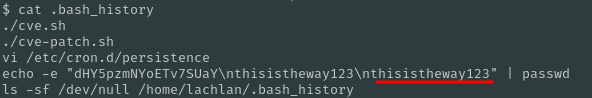

With this information, an SSH connection as `lachlan` was established successfully:

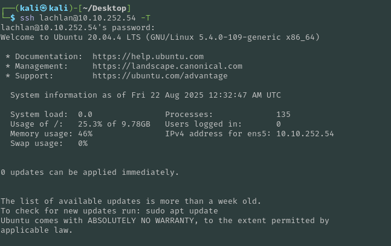

### 4.5 Privilege Escalation via PATH Hijacking

Once inside as `lachlan`, a malicious binary was created to replace the `pkill` command in `/home/lachlan/bin`:

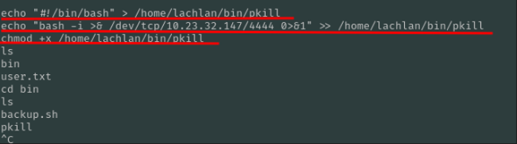

A Netcat listener was started again on the attacker machine. When the cron job executed, it triggered the malicious `pkill` binary, providing a root reverse shell.

### 4.6 Root Shell & Flag Retrieval

The connection was established with full root privileges:

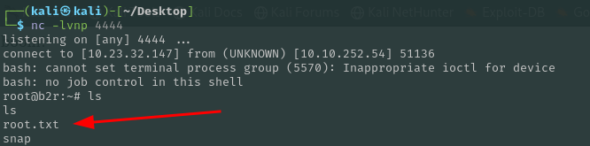

Accessing `/root` revealed the final flag:

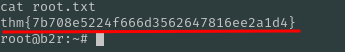

**Root Flag:** `thm{7b708e5224f666d3562647816ee2a1d4}`

____
## **5. Conclusion & Mitigations**

This machine was compromised by chaining together multiple weaknesses:

- **Initial Access:** A flawed file upload filter allowed the upload of a PHP webshell (`shell.pdf.php`), providing remote code execution under the `www-data` user.
- **Privilege Escalation:** A misconfigured cron job with an insecure PATH variable enabled PATH hijacking. Combined with write access to `/home/lachlan/bin`, this led to execution of a malicious binary as root.
- **Credential Leakage:** Sensitive data (a password) was exposed in Lachlan’s `.bash_history`, which facilitated SSH access.

### **Mitigation Recommendations**

1. **Secure File Uploads:**
    - Implement strict file type validation by MIME type and extension.
    - Store uploads outside of the web root and scan files for malicious content.
2. **Cron Job Security:**
    - Avoid including user-writable directories in the PATH of privileged cron jobs.
    - Use absolute paths for all binaries executed in cron.
3. **Credential Hygiene:**
    - Avoid storing plaintext passwords in command history.
    - Configure systems to disable history logging for sensitive commands.
4. **Principle of Least Privilege:**
    - Restrict write permissions on sensitive directories.
    - Ensure users cannot interfere with processes running as root.

By addressing these misconfigurations and adopting secure coding and system administration practices, the risk of similar compromises can be significantly reduced.

