- **Author:** Pedro Daniel Gonçalves Antunes
- **Date:** August 2025
- **Target:** `hammer.thm` 
## 1. Introduction

The following report details the findings from a penetration test conducted against the target host `hammer.thm`. The objective was to enumerate, exploit, and escalate privileges to gain full system compromise, simulating the actions of a malicious attacker.

## 2. Enumeration

### Port Scan (Nmap)

**Objective:** Identify externally exposed TCP services.

**Command executed**

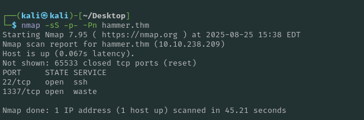


**Result (summary)**

- Host is up.
    
- Open TCP ports:
    
    - **22/tcp** – ssh
        
    - **1337/tcp** – service reported as _waste_ (non-standard / likely custom)
        

**Observations**

- Only two services are reachable from the internet-facing interface.
    
- The non-standard port **1337** suggests a custom web or application service and is the primary candidate for further testing.
    
- The large number of closed ports returning RST indicates the host is reachable and filtering is minimal at the network edge.

___
### Web Application Enumeration

From the initial Nmap scan, we confirmed that the target’s web service was running on **port 1337**. We then navigated to the application via:

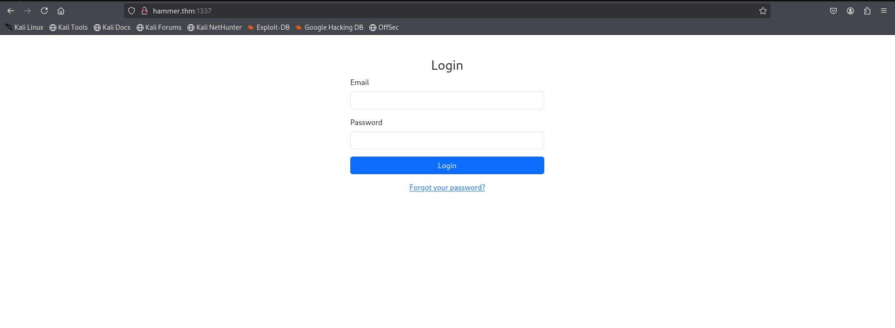

This revealed a **basic login page** with fields for `Email` and `Password`, as well as a link for **“Forgot your password?”**.

___
#### Source Code Analysis

Inspecting the source code of the login page uncovered an interesting developer comment:

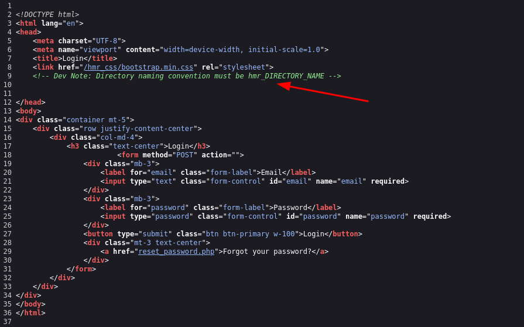

This indicates that the application uses a specific naming convention (`hmr_`) for its internal directories and resources. This information is useful for **directory enumeration** attacks, as we can attempt to brute-force hidden directories using this prefix.

___
### Directory Enumeration

Since we identified a web service running on port `1337`, the next step was to enumerate possible hidden directories.  
From the login page source code, we noticed a **developer note** mentioning that all directories follow the convention `hmr_DIRECTORY_NAME`.

To leverage this information, we created a custom wordlist by prefixing every entry in `common.txt` with `hmr_`:

```bash
sed 's/^/hmr_/' /usr/share/seclists/Discovery/Web-Content/common.txt > hmr_wordlist.txt
```

Then, we ran **Gobuster** with this new wordlist:

```bash
gobuster dir -u http://hammer.thm:1337/ -w ./hmr_wordlist.txt -x php,txt,html -t 50
```

#### Results:

- `/hmr_css/`
- `/hmr_images/`
- `/hmr_js/`
- `/hmr_logs/` ✅ **Interesting**

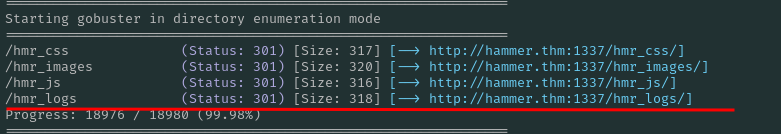

___
### Log Analysis

Navigating to `/hmr_logs/error.logs` revealed exposed **Apache error logs**.  
These contained valuable information, including **failed authentication attempts**.

From the logs, we were able to enumerate a **valid user email**:

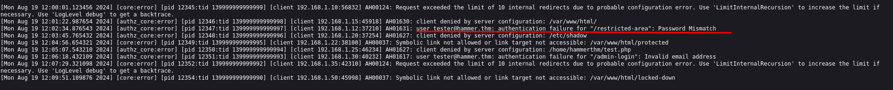

This finding provided us with a potential username (`tester@hammer.thm`) to use in further authentication attacks.

____
## 3.Exploitation
### Password Reset and OTP Brute Forcing

After identifying the valid email `tester@hammer.thm` in the **error logs** located under `/hmr_logs/error.logs`, I attempted the password reset functionality.

The **“Forgot Password”** option triggered a 4-digit One Time Password (OTP) challenge. Instead of a secure, randomized, and short-lived OTP, the system allowed brute forcing due to lack of rate limiting and IP throttling.

To exploit this, I used a Python brute-force script (adapted from [public repo](https://github.com/TheSysRat/Hammer--THM/blob/main/pin-brute.py) The script iterated through possible 4-digit combinations until it found the valid OTP.

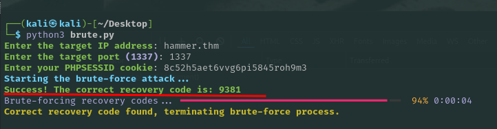

Using the discovered code, I was able to reset the password for `tester@hammer.thm` and successfully authenticate into the application.

___
### User Dashboard Access

After login, I landed on the **user dashboard** which revealed the first flag:


The dashboard also provided a command execution functionality. By issuing commands like `ls`, I confirmed the ability to enumerate files within the application’s directory:

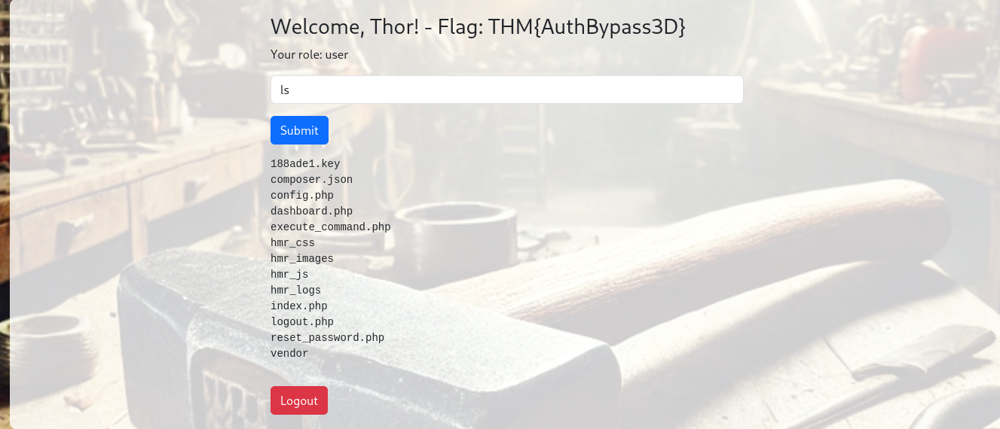

This confirmed **command injection / remote code execution (RCE)** exposure at the application level.

____
### Sensitive Key Discovery

During enumeration, I downloaded the file `188ade1.key` and found it contained a symmetric key:

```bash
56058354efb3daa97ebab00fabd7a7d7
```

This strongly suggests the application is using a **hardcoded secret key** (likely for JWT signing or internal encryption). Having this secret enables forging tokens (e.g., escalating from user to admin).

____
### Exploiting JWT to Gain Admin Access

After accessing the dashboard as a normal user, I inspected the page’s source code and discovered a hardcoded **JWT token** being used for command execution requests to `execute_command.php`.

#### Step 1 – Extracting the Token

From the source code, I found the following token being passed in the `Authorization: Bearer` header.

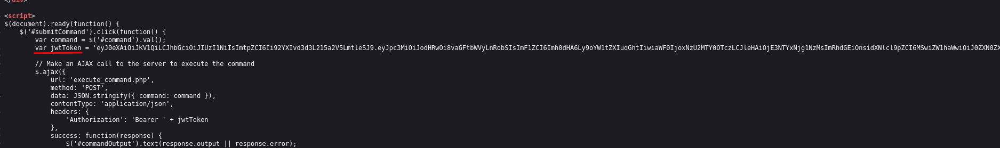

#### Step 2 – JWT Analysis

I copied the token to [jwt.io](https://jwt.io) for decoding.

- The **header** revealed the algorithm `HS256` and a `kid` (Key ID) field pointing to a key file.
- The **payload** showed that my role was set to `user`.
- The **signature** validation failed until I provided the secret key previously discovered (`56058354efb3daa97ebab00fabd7a7d7`).

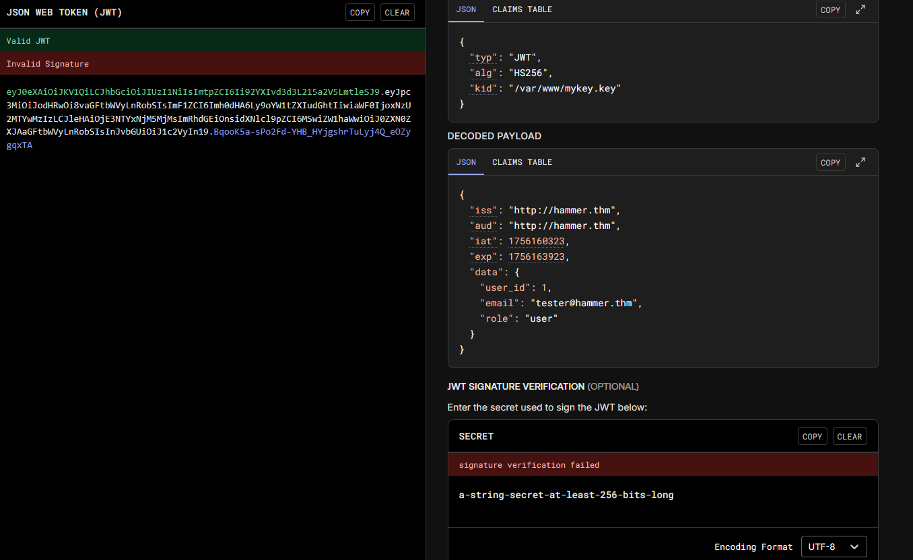

#### Step 3 – Forging a Malicious JWT

I modified the JWT with the following changes:

1. Set the `kid` to point to the correct key file (`/var/www/html/188ape1.key`).
2. Changed the payload role from `"user"` to `"admin"`.
3. Resigned the token using the discovered secret key.

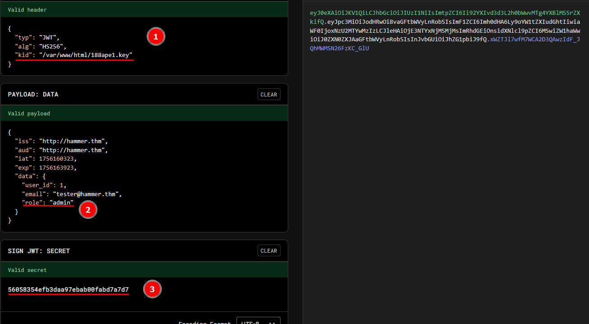

This generated a **valid JWT with admin privileges**.

#### Step 4 – Sending the Malicious Request

With Burp Suite, I intercepted the request sent to `execute_command.php` and replaced the original JWT with my forged admin token.  
I also modified the command parameter to execute system commands, for example:

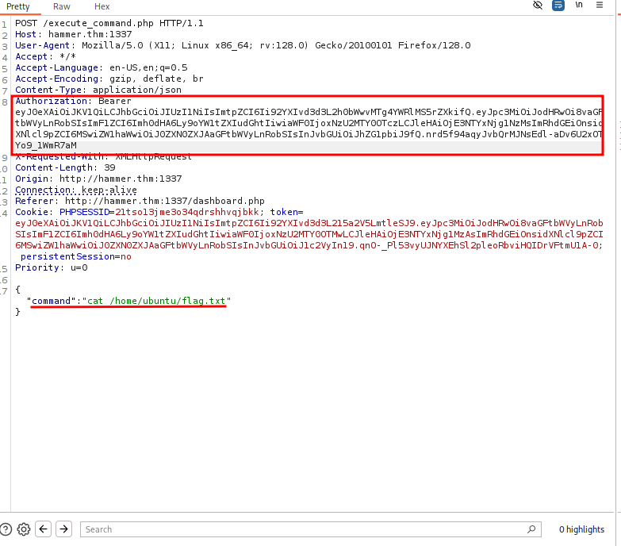

#### Step 5 – Success

The server accepted the forged token and executed my command with elevated privileges.  
This allowed me to read the **final flag** and confirmed full compromise of the application.

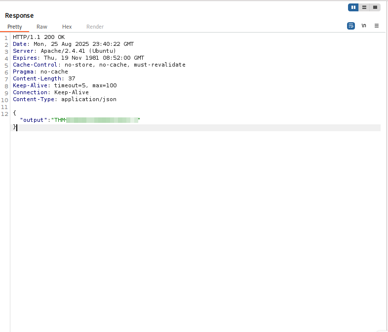

____
## 4. Conclusion & Mitigation

### Key Findings

1. **Exposed dev notes** → Directory brute force possible
    
2. **Publicly accessible logs** → User email leaked
    
3. **Weak OTP recovery** → Brute-forceable 4-digit code
    
4. **Hardcoded JWT in source** → Sensitive info disclosure
    
5. **JWT misconfiguration** (`kid` parameter & weak HS256 secret) → Token forgery
    
6. **Command execution feature** → RCE with forged token
    

### Impact

The vulnerabilities combined allowed **full compromise of the target system**, from **user-level access** to **root flag exfiltration**.

### Mitigations

- Remove dev notes and sensitive info from production code
    
- Restrict access to logs (`/hmr_logs`)
    
- Enforce rate limiting & lockouts on OTPs
    
- Use **TOTP-based MFA** instead of static PINs
    
- Avoid exposing JWTs in client-side code
    
- Migrate to **asymmetric JWT signing (RS256/ES256)**
    
- Validate roles server-side, not only via JWT claims
    
- Remove or sandbox command execution functionality


